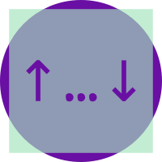

<div align="center">
  
  <h1>api</h1>
  <p>
    <b>NodeJS Express API Sandbox</b>
  </p>
  <br />
  <br />
</div>

## Motivation

I'm constantly finding I need an API for a side project; or want to try out some new ideas; or want to learn something new. Instead of going through the motions of setting up a 'half-hearted' API each time - I thought I would create a "sandbox" that I can use for any of them.

## Usage

```bash
npm install
npm start
```

## Dependencies

- [NodeJS](https://nodejs.org/) - LTS v12.13.0

- [ExpressJS](https://expressjs.com/) - Fast, unopinionated, minimalist web framework for Node.js

- [Nodemon](https://nodemon.io/) - Nodemon is a utility that will monitor for any changes in your source and automatically restart your server
